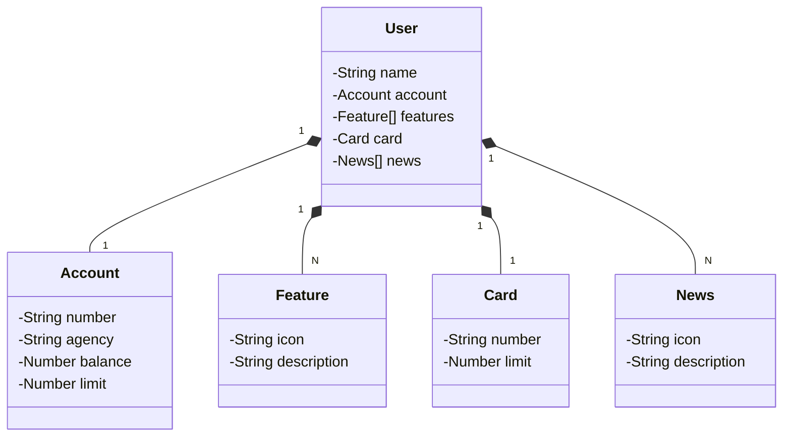

## API Santander Dev Week 2023: Uma Imersão em Java 17 e Spring Boot

Uma API RESTful desenvolvida durante a Santander Dev Week 2023, utilizando as tecnologias mais recentes do Java.

### Tecnologias Utilizadas
* **Java 17:** A mais recente versão LTS do Java, proporcionando performance e recursos modernos.
* **Spring Boot 3:** Framework para desenvolvimento de aplicações Java, simplificando a configuração e o desenvolvimento.
* **Spring Data JPA:** Facilita o acesso a bancos de dados relacionais.
* **OpenAPI (Swagger):** Gera documentação interativa da API.
* **Railway:** Plataforma para deploy e gerenciamento de aplicações.

## Diagrama de Classes (Domínio da API)



### Documentação da API
A documentação completa da API está disponível em: https://sdw-2023-prd.up.railway.app/swagger-ui.html

### Funcionalidades
* **Gerenciamento de usuários:** Crie, edite e delete usuários.
* **Gerenciamento de contas:** Crie contas, verifique saldos e realize transações.
* **Notificações:** Receba notificações sobre transações e eventos.

### Desafios e Soluções
* **Integração com sistemas legados:** Descreva como a API se integra com outros sistemas.
* **Segurança:** Discuta as medidas de segurança implementadas para proteger os dados.
* **Escalabilidade:** Explique como a API foi projetada para lidar com um grande volume de requisições.

### Próximos Passos
* **Adicionar novas funcionalidades:** Explorar novas features como autenticação biométrica e pagamentos por aproximação.
* **Melhorar a performance:** Otimizar a API para responder a requisições de forma mais rápida.
* **Implementar testes automatizados:** Garantir a qualidade do código através de testes unitários e de integração.

**Código exemplo (Spring Boot):**
```java
@RestController
@RequestMapping("/users")
public class UserController {

    @Autowired
    private UserService userService;

    @PostMapping
    public ResponseEntity<User> createUser(@RequestBody User user) {
        // Lógica para criar um novo usuário
    }
}
